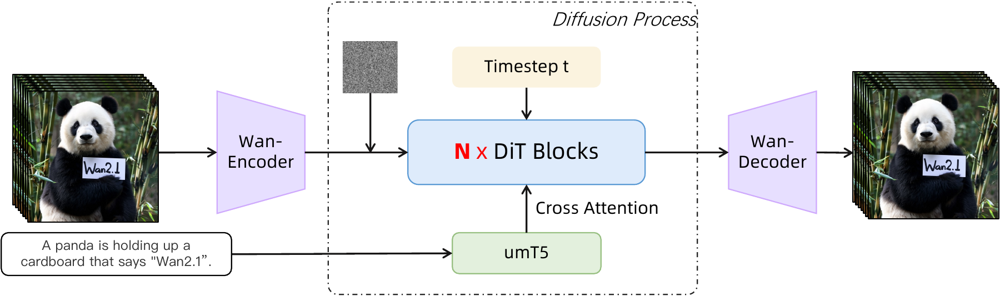
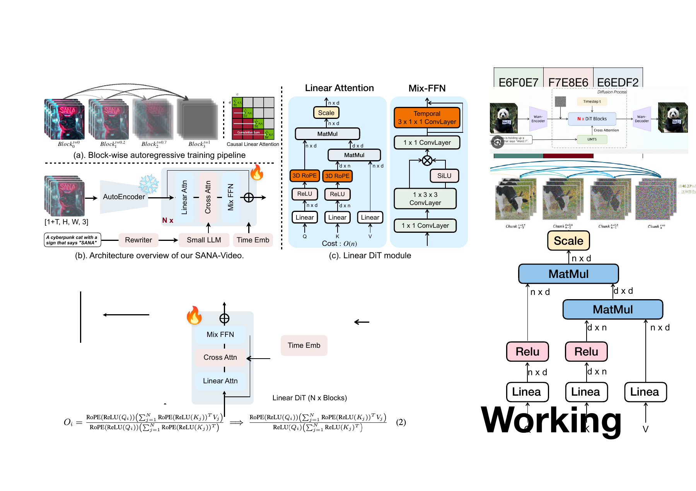
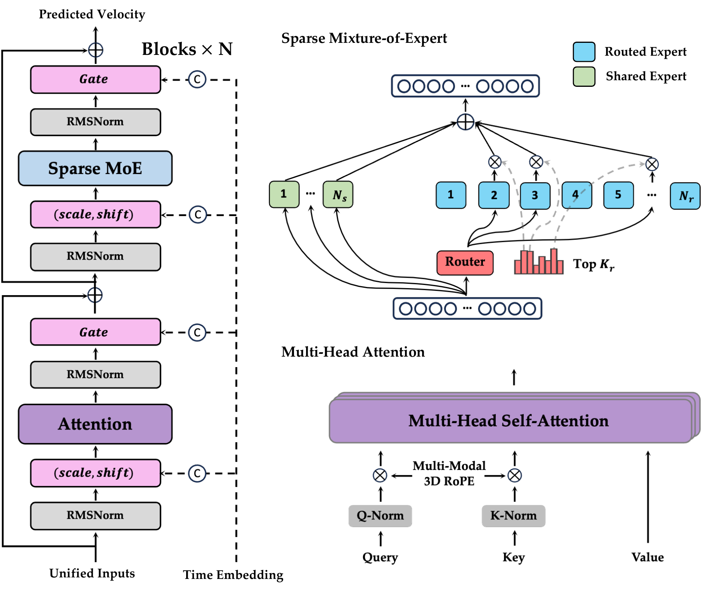
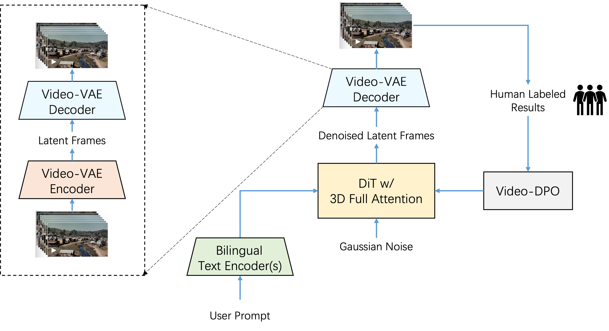
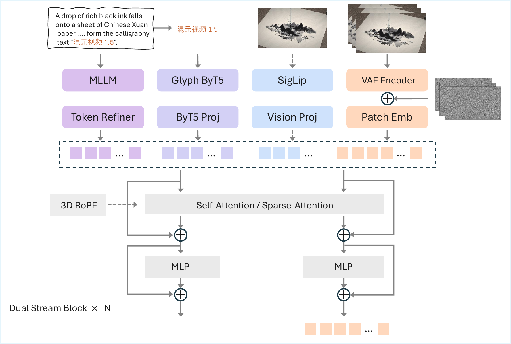
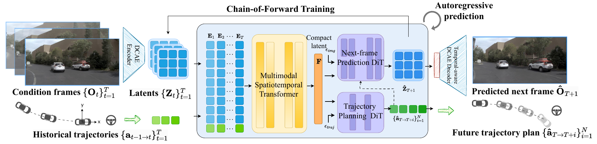

# 视频生成模型发展笔记（截至 2026-09-12）

> 本讲义按“视频表示 → 扩散/DiT → 高效生成 → 多模态 → 世界模型”的递进关系组织。2026 年模型的公开信息可能随产品更新，文中将论文结果与厂商规格分开标注。

## 1. 从像素预测到潜空间生成

早期 VideoGPT、DVD-GAN 等方法在像素或离散 VQ-VAE token 上逐帧自回归，能够表达因果关系却受到序列长度和采样速度限制。Make-A-Video、Imagen Video 等把图像扩散模型扩展到时空 U-Net：空间层继承图像先验，时间卷积/注意力负责运动。这样画质显著提升，但时空注意力的显存复杂度随帧数迅速增长。

2024 年 Sora 展示了潜空间 patch + Diffusion Transformer（DiT）的缩放规律。视频先由 3D VAE 压缩成 $z\in\mathbb{R}^{T\times H\times W\times C}$，再将时空 patch 当作 Transformer token。HunyuanVideo 和 Wan 将这一路线开源并扩展到 13B/14B 参数规模。

## 2. 扩散、Flow Matching 与复杂度

DDPM 在噪声层级 $t$ 上预测噪声：

$$\mathcal L_{\mathrm{DDPM}}=\mathbb E\|\epsilon-\epsilon_\theta(z_t,t,c)\|_2^2.$$

Flow Matching 改为回归从噪声到数据的速度场：

$$\mathcal L_{\mathrm{FM}}=\mathbb E\|v_\theta(z_t,t,c)-(z_0-z_1)\|_2^2,$$

配合 ODE 求解和蒸馏可用更少步数采样。视频 token 数 $N=T\!\times\!H\!\times\!W$，全注意力为 $O(N^2)$；因此 SANA 采用线性注意力，LingBot 采用 MoE 只激活少数专家。

## 3. 关键模型

### Genie（DeepMind，2024）

论文：[Generative Interactive Environments](https://arxiv.org/abs/2402.15391)。Genie（约 11B）从无动作标签的互联网游戏视频学习三部分：时空 tokenizer、由相邻帧反推离散动作的 latent-action 模型，以及根据历史 latent 和动作预测下一状态的自回归 dynamics 模型。它按帧 rollout，可由键盘/鼠标控制，目标是学习环境转移而非只生成一段好看的 T2V 视频。Genie-2/3 在后续版本加入更强文本/图像条件和实时交互；具体规格应以官方发布为准。

### HunyuanVideo（腾讯，2024）

论文：[arXiv:2412.03603](https://arxiv.org/abs/2412.03603)，[代码](https://github.com/Tencent-Hunyuan/HunyuanVideo)。13B DiT 使用因果 3D-VAE（时间压缩 4×、空间 8×、通道 16×），文本由 MLLM 编码。其 **dual-stream→single-stream** 结构先分别调制视频和文本 token，再拼接做全注意力融合，并用双向 token refiner 强化文本。图像/视频联合训练，支持 T2V、I2V、V2V 编辑和个性化。优点是开源质量和复杂运动，缺点是全注意力带来的显存与速度开销。

### Wan 2.1（阿里 Wan-Video，2025）

论文：[Wan: Open and Advanced Large-Scale Video Generative Models](https://arxiv.org/abs/2503.20314)，[代码](https://github.com/Wan-Video/Wan2.1)。Wan 提供 1.3B 与 14B 两档，采用因果 Wan-VAE、DiT、Flow Matching、文本 cross-attention 和 full spatio-temporal attention。数十亿图像/视频（约万亿 token）联合预训练，覆盖 T2V、I2V、V2V 指令编辑、个性化等任务。1.3B 约需 8.2GB 显存，14B 质量更高但推理较慢。相较 HunyuanVideo，Wan 更强调多任务统一和消费级部署。

### MiniMax Hailuo-02（2025）与 H3（2026）

Hailuo-02 的官方技术介绍使用 **Noise-aware Compute Redistribution（NCR）**，按噪声/SNR 阶段重新分配网络计算，在相近参数规模下宣称约 2.5× 效率提升；产品支持 6/10 秒、最高 1080p，物理和光照表现突出，但完整论文和权重未公开。见[官方介绍](https://www.minimax.io/news/minimax-hailuo-02)。

MiniMax H3 于 2026-07-31 发布（[官方博客](https://www.minimax.io/blog/minimax-h3)）。它用 Contextual Omni Representation、H3-VAE、H3-Omni Transformer 与 In-Context Regeneration，统一文字、图像、视频、音频上下文，原生生成立体声对白/音效，最高 2K、15 秒。H3 支持多参考和自然语言 V2V 编辑。官方表示计划开放权重；截至截稿应标为“厂商披露，权重状态可能变化”。

### SANA-Video / SANA-Video 2.0（NVIDIA，2025–26）

论文：[SANA-Video](https://arxiv.org/abs/2509.24695)，[文档](https://nvlabs.github.io/Sana/docs/sana_video2/)。SANA-Video 从图像 SANA 继续预训练，引入 Linear DiT 与块式自回归，利用线性注意力的累积性质维护恒定内存 KV 状态，可生成分钟级 720×1280 视频；实测比 Wan-1.3B 快约 16×。SANA-Video 2.0 5B 采用 75% gated linear-attention、25% softmax anchor、Attention Residual、Wan 3D-RoPE 和 LTX-2.3 VAE，并提供 50 步和 DMD 4 步模型。

### LingBot-Video / LingBot-World（Robbyant，2026）

论文：[LingBot-Video](https://arxiv.org/abs/2607.07675)，[代码与权重](https://github.com/Robbyant/lingbot-video)。LingBot-Video 是面向具身智能的开源 MoE 视频基础模型（仓库型号 30B-A3B），将互联网视频与机器人操作、导航、第一视角数据混合，并以物理合理性、任务完成度等多维奖励后训练。其目标从“审美与文本遵循”扩展到动作条件和可执行世界。LingBot-World 2.0（[arXiv:2607.07534](https://arxiv.org/abs/2607.07534)）进一步支持动作交互和实时蒸馏版本。

### FLUX.3 Video（Black Forest Labs，2026-07）

截至 2026-09 尚无公开论文/权重，产品与 API 资料宣称统一图像、视频、音频和动作，支持约 20 秒镜头、原生音频、时间码关键帧及多镜头草稿到精修。由于训练目标和架构未披露，不能与 Wan/Hunyuan 做参数级比较，表中应标注“闭源、厂商规格”。

## 4. 时间线

|时间|里程碑|方法变化|
|---|---|---|
|2019–21|VideoGPT、DVD-GAN|离散 token/像素自回归与 GAN，短片低分辨率|
|2022|Make-A-Video、Imagen Video|图像扩散迁移到时空 U-Net|
|2023|VideoCrafter、AnimateDiff、Lumiere|时空注意力、运动模块、DiT 基础|
|2024-02|Sora；Genie|潜空间 DiT 缩放；latent-action 世界模型|
|2024-12|HunyuanVideo|13B、双流到单流 DiT、3D-VAE，开源|
|2025-03|Wan 2.1；Hailuo-02|Flow Matching 多任务开源；NCR 提效|
|2025-09|SANA-Video|Linear DiT、恒定内存 KV、分钟级视频|
|2026-01–07|LingBot、SANA-Video2、MiniMax H3、FLUX.3|MoE 具身、混合注意力/蒸馏、统一音视频、关键帧和原生音频|

## 5. 模型对比

|模型|范式/模块|条件与输出|开放性|取舍|
|---|---|---|---|---|
|Genie|latent action + AR dynamics|动作控制、逐帧 rollout|研究原型|交互强，画质低|
|HunyuanVideo|13B DiT、双流→单流、3D-VAE|T2V/I2V/V2V，约 5s|开源|质量高，显存大|
|Wan 2.1|1.3B/14B DiT + Flow Matching|T2V/I2V/编辑|开源|多任务、可消费级部署|
|Hailuo-02|NCR|6/10s，最高 1080p|闭源|物理好、细节少|
|SANA-Video2|线性+softmax anchor、DMD|5B，720p/8s|开源 5B|速度快，质量略逊大模型|
|MiniMax H3|Omni 表示、H3-VAE、原生音频|2K/15s，多参考|计划开放|统一多模态，规格未全公开|
|LingBot-Video|MoE DiT（30B-A3B）、具身奖励|动作条件、T2V/TI2V|开源|物理/效率强，审美非唯一目标|
|FLUX.3|统一图像/视频/音频/动作（细节未公开）|20s、关键帧、原生音频|闭源|产品控制强，难复现|

## 6. 榜单阅读方法（截至 2026-09-12）

没有跨任务公认的单一总榜。应分别报告闭源综合质量（FLUX.3、Veo、Sora、MiniMax H3 等第一梯队）、开源质量（LingBot、Wan 14B、HunyuanVideo）、效率（SANA-Video2）和交互世界模型（LingBot-World、Genie）。记录评测日期、分辨率、时长、是否含音频及人工/自动指标，避免把不同设置直接横比。

## 问题驱动的发展脉络与架构图

视频生成的跃迁来自瓶颈变化：VideoGPT 以 VQ-VAE 离散 token + Transformer 压缩逐像素序列，但序列过长；Make-A-Video/Imagen Video 以图像扩散先验和时空层提升画质，但长程运动不稳；Sora 以 3D-VAE + DiT 把时空块统一成 token，靠规模扩展，代价是全注意力的 $O(N^2)$。HunyuanVideo 与 Wan 将其开源化：前者用 dual-stream→single-stream 强化文本-视频融合，后者用 Flow Matching 与多任务训练统一 T2V/I2V/V2V。

当视频变长，SANA-Video 以线性注意力、块式自回归和蒸馏控制显存与采样步数，代价是近似注意力对远距离对应建模较弱。Genie 从无动作标签视频反推 latent action，使模型成为可交互环境；LingBot 再把机器人轨迹和物理/任务奖励加入 MoE 视频模型，使输出服务具身规划，但训练数据和评测更复杂。MiniMax H3 沿多模态方向以统一上下文和原生音频处理生成、编辑与听觉一致性。

## 重要论文原始架构图

以下图片均从论文 arXiv 源码或作者官方仓库提取，保存在 `assets/original/`，不是自行绘制的示意图。Markdown 中使用本地图片；点击来源可核对论文原图与图号。

### Genie：latent action 世界模型

Genie 用时空 tokenizer 将视频离散化，LAM 从相邻帧无监督推断 latent action，dynamics 根据历史 token 和动作逐帧预测下一帧。它解决的是“没有动作标签也要能交互控制”的问题。来源：[arXiv HTML](https://arxiv.org/html/2402.15391)，Fig. 2/3/6。

### HunyuanVideo：Causal 3D-VAE 与 DiT

HunyuanVideo 先用 causal 3D-VAE 压缩视频，再用文本编码器和 DiT 去噪；双流阶段分别处理视觉与文本，单流阶段进行全注意力融合。它解决的是开源模型的高分辨率、文本对齐和规模化训练问题。来源：[Tencent 官方架构图](https://github.com/Tencent/HunyuanVideo/blob/main/assets/hunyuanvideo.pdf)。

### Wan：Flow Matching 统一多任务

Wan 将 T2V、I2V、V2V 编辑统一到 Wan-VAE + Flow Matching DiT。文本、首帧或参考视频通过条件编码进入 cross-attention；Flow Matching 用连续速度场减少采样步数。来源：[Wan arXiv HTML](https://arxiv.org/html/2503.20314)，Fig. 9/10。

### SANA-Video：线性注意力与长视频

SANA-Video 针对长视频的 $O(N^2)$ 注意力瓶颈，引入 Linear DiT、块式 KV cache 和自回归分块；SANA-Video 2.0 再加入 softmax anchor 与 DMD 四步蒸馏。来源：[SANA-Video arXiv HTML](https://arxiv.org/html/2509.24695)，Fig. 2。

### LingBot-Video：MoE 与具身后训练

LingBot 将互联网视频和机器人操作/导航数据混合训练，以 MoE DiT 只激活少量专家，并用物理合理性、动作可执行性和任务完成度奖励后训练。它解决的是“视觉上合理”与“机器人能执行”之间的差距。来源：[LingBot-Video arXiv HTML](https://arxiv.org/html/2607.07675)，Fig. 2。

> PDF 格式图片在 GitHub Markdown 预览中可能不会直接显示，但 LaTeX 会直接插入；如需 Markdown 预览，可将对应 PDF 用 `pdftoppm -png` 转为 PNG。

## 世界模型延伸阅读

- [Xun Huang：From Video Generation to Video World Models](https://www.xunhuang.me/blogs/world_model.html)：从“视觉逼真”区分到“可交互、可规划、可记忆”的世界模型，并讨论视频生成、3D 结构和行动条件之间的关系。
- [Video World Models（长文综述）](https://video-world-models.github.io/blog/video-world-models/)：解释双向扩散为何难以充当世界模拟器，以及 Self-Forcing、检索增强和长上下文记忆的作用。
- [Long-Context State-Space Video World Models](https://arxiv.org/abs/2505.20171)：用 block-wise SSM 扩展时间记忆，缓解 Transformer KV cache 随历史增长的问题。
- [Learning World Models for Interactive Video Generation](https://arxiv.org/abs/2505.21996)：指出自回归 rollout 的误差累积和记忆不足，并提出视频检索增强的全局状态条件。
- [Can Video World Models Track Unobserved World States?](https://arxiv.org/abs/2608.30692)：提醒“画面看起来合理”并不代表模型维护了不可见状态；可修正的内部状态是长时外推的关键。

## 2025–2026 扩展：不应遗漏的代表性 SOTA

### Step-Video-T2V：深压缩 VAE 与视频 DPO

**瓶颈**：30B 级 Video DiT 的时空 token 太多，长视频训练成本高，而且仅靠去噪目标容易出现伪影。**方法**：Step-Video 使用 8 倍时间、16×16 空间压缩的 Video-VAE，双语文本编码器、3D full-attention DiT 和 Flow Matching；再用 Video-DPO 做偏好后训练。**影响**：把“更深压缩 + 偏好优化”纳入开放视频基础模型配方，但复杂物理交互仍有限。论文：[Step-Video-T2V](https://arxiv.org/abs/2502.10248)。

### HunyuanVideo 1.5：选择性滑窗注意力与超分级联

**瓶颈**：HunyuanVideo 13B 的全注意力推理昂贵，高清输出与速度难兼顾。**方法**：8.3B DiT 使用 selective/sliding tile attention（SSTA）减少无效 token 交互，先生成基础视频，再用视频超分网络提升分辨率；配合多阶段训练和 glyph-aware 文本编码。**影响**：说明“稀疏/局部注意力 + 级联超分”可以在较小参数下维持运动质量。论文：[HunyuanVideo 1.5](https://arxiv.org/abs/2511.18870)。

### Epona：把视频生成与轨迹规划解耦

**瓶颈**：自动驾驶世界模型既要预测高清未来，又要支持实时轨迹规划；单一全局视频分布难以处理分钟级 rollout。**方法**：Epona 将时空动力学、未来帧生成和车辆轨迹拆成模块，使用 causal transformer 预测 latent dynamics，两个扩散分支分别生成视频和轨迹，并用 chain-of-forward 训练缓解误差累积。**影响**：代表视频世界模型从“渲染未来”走向“生成未来并直接规划”。论文：[Epona](https://arxiv.org/abs/2506.24113)。

### SkyReels-V2/V3/V4：长片、参考一致性与音视频统一

SkyReels-V2 通过 shot-aware caption、专家镜头语言模型、motion RL 和 diffusion forcing 追求无限长度；SkyReels-V3 将参考图 I2V、视频延长和音频引导统一到 in-context DiT；SkyReels-V4 进一步采用 dual-stream MMDiT，把视频生成、修补、编辑和音频同步视为统一的条件 inpainting。论文：[V2](https://arxiv.org/abs/2504.13074)、[V3](https://arxiv.org/abs/2601.17323)、[V4](https://arxiv.org/abs/2602.21818)。

### LanDiff、FlashVideo 与 FSVideo：语义先行和极限加速

LanDiff 把 3D 视觉特征压成约 14,000 倍的 1D 语义 token，由语言模型先规划，再由 streaming diffusion 精修；FlashVideo 用低分辨率大模型保证语义/运动，高分辨率 Flow Matching 只需约 4 步补细节；FSVideo 则用高度压缩 latent、layer memory 和多分辨率 refiner 获得大幅速度提升。它们共同说明：下一阶段不一定继续堆大 dense DiT，而是把语义规划、视频细节和采样计算拆开。论文：[LanDiff](https://arxiv.org/abs/2503.04606)、[FlashVideo](https://arxiv.org/abs/2502.05179)、[FSVideo](https://arxiv.org/abs/2602.02092)。

### 长视频稳定性：Endless World、Cycle-World、BAgger 与 Diagonal Distillation

这些工作针对同一核心问题：自回归生成时，训练看到真实历史，推理却看到自身生成的历史，误差会累积。Endless World 注入全局 3D 特征与 attention sink；Cycle-World 用反向预测和 cycle guidance 约束可逆性；BAgger 让模型学习从自己的错误 rollout 中恢复；Diagonal Distillation 让早期 chunk 使用更多去噪步、后续 chunk 使用更少步，从而在速度和上下文之间折中。论文：[Endless World](https://arxiv.org/abs/2512.12430)、[Cycle-World](https://arxiv.org/abs/2607.11836)、[BAgger](https://arxiv.org/abs/2512.12080)、[Diagonal Distillation](https://arxiv.org/abs/2603.09488)。

## Xun Huang 博客带来的统一视角

Xun Huang 的路线把视频生成模型按能力而非产品名称理解：第一层是 **faithfulness**（画面和运动逼真），第二层是 **interactivity**（动作改变未来），第三层是 **planning**（模型可评估轨迹、支持策略学习），第四层是 **statefulness**（跨长时、多视角和不可见状态保持记忆）。这解释了为什么单纯比较 VBench 或人类美学分数不够：双向扩散模型可以生成漂亮短片，却未必能在干预后给出因果一致的未来。

从架构上看，博客强调三条进化线：用 causal/self-forcing 把双向教师蒸馏为可流式 rollout；用 SSM、线性注意力、KV cache 或显式 world-state 解决长上下文；用 3D 几何、相机和动作条件把视频从“像素预测”推进到“可执行模拟”。本讲义中的 Genie、SANA-WM、LingBot、Epona、Endless World 和 WorldWeaver 正好对应这三条线的不同取舍。

> 文献检索说明：2025--2026 扩展部分使用 DeepXiv CLI 的 deepxiv search 语义检索，并对入选论文用 arXiv HTML/源码核对方法与架构图。

