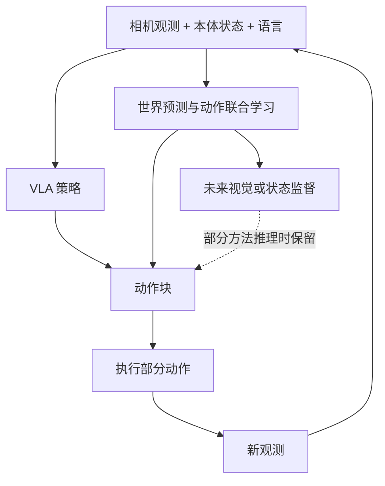

# 从零理解 VLA、世界模型与 WAM

本文是学习用的综合解释，不是某一篇论文的方法复述。具体实现和证据见各篇笔记。

## 1. 先把机器人一次决策讲清楚

以“把杯子放进碗里”为例。相机给出图像，关节传感器给出机器人状态，用户给出语言指令。模型输出一段动作，控制器执行其中一部分，再观察，再决策。

| 符号 | 含义 | 例子 |
|---|---|---|
| `o_t` | 当前或历史观测 | 外部相机、腕部相机图像 |
| `q_t` | proprioception，本体状态 | 关节角、末端位姿、夹爪状态 |
| `l` | 语言任务 | 把杯子放进碗里 |
| `a_t` | 一个控制时刻的动作 | 末端增量位姿与夹爪命令 |
| `A_t` | action chunk，未来 H 步动作 | `[a_t, …, a_(t+H-1)]` |
| `s_t` | 环境真实状态 | 物体位置、接触、速度等，真实部署通常不能全观测 |
| `v` | 相机视角 | 固定外部相机或随手腕运动的相机 |

动作并没有统一格式。关节位置、关节速度、末端绝对位姿、末端增量位姿都可能出现。读每篇论文必须先确认动作维度、坐标系、单位、控制频率、归一化和夹爪编码。

**Action chunking** 是一次预测多步动作；**receding horizon** 是执行部分动作后重规划。因此“每秒生成多少个动作块”“机器人每秒执行多少条控制命令”“一次重规划需要多久”是三个指标。

## 2. VLA 学什么，世界模型学什么

VLA 通常学习条件策略：

`π(A_t | o_≤t, q_t, l)`

它把视觉与语言转成可执行动作。OpenVLA 用离散动作 token；π0 用连续动作 flow matching。是否使用扩散、是否多相机、是否引入未来预测，不由“VLA”这个名字单独决定。[OpenVLA](https://arxiv.org/abs/2406.09246)、[π0](https://arxiv.org/abs/2410.24164)。

动作条件世界模型的常见形式是：

`p(o_(t+1:t+H) | o_≤t, A_t, l)`

它回答“执行这段动作后会看到什么”。但也有模型只从当前观测和语言预测未来；这种条件里没有候选动作的模型，不能直接当作可反事实比较动作后果的动力学模型。Fast-WAM 的视频监督需要结合它的 attention mask 理解，不能只看名称。[Fast-WAM §3](https://arxiv.org/html/2603.16666v2)。

WAM 的使用范围尚未完全统一。本文用它指将世界预测与动作学习结合的这组工作，可涉及联合生成、视频生成后反演动作，或训练时世界监督、推理时只出动作。VLA 与 WAM 并非严格互斥的集合。[UVA](https://arxiv.org/abs/2503.00200)、[WorldVLA](https://arxiv.org/abs/2506.21539)、[DreamZero](https://arxiv.org/abs/2602.15922)。

图中未来分支是否参与部署取决于具体架构，不能由这张概念图推断模型的注意力方向。

## 3. 读架构图：先找四件事

第一，**输入如何表示**。图像经过视觉编码器变成特征，或经过 VAE 压缩为 latent；语言可能来自 LLM/VLM 或独立文本编码器；本体状态经过映射后进入模型。多相机可能是拼图、拼 token、独立分支或 3D 融合，不能都称为几何对齐。

第二，**骨干继承了什么预训练能力**。VLM 的图文语义先验与视频生成模型的时空先验不同。比较论文时，“用了更多视频预训练”是一个混杂因素，不能都归功于新模块。

第三，**输出是什么**。动作离散 token、连续动作向量、未来视频 latent、深度/点云、value 都可能是输出。value 可用来估计结果好坏，但有 value 输出不自动说明模型做了搜索或强化学习。

第四，**训练和推理的信息流是否相同**。看 attention mask：动作能否看到未来视觉 token？看到的是 ground truth、带噪真值还是生成结果？测试时拿不到的真值若进入动作路径，会产生训练/推理差距。Fast-WAM 的受控变体特别适合学习这个问题。[Fast-WAM](related-work/fast-wam.md)。

## 4. 三种动作学习方法

### 离散动作 token

把连续动作量化为 token，再用自回归交叉熵训练：

`L_action = -Σ_i log p(token_i | context, token_<i)`

OpenVLA 的原始方法逐维离散化；FAST 先将动作时间序列变换/压缩，再形成短 token 序列。二者都不能只按“token 数”评价控制质量，还要看量化误差、解码延迟与闭环结果。[OpenVLA](related-work/openvla.md)、[FAST](related-work/fast-tokenizer.md)。

### Diffusion policy

训练时向真实动作块加噪，模型根据观测预测噪声或其他等价目标；测试时从噪声迭代生成动作块。直觉是学会从很多可能动作中产生一段连贯的动作，适合多模态行为。Diffusion Policy 是很好的基础，但原始论文不等于大规模语言条件 VLA。[Diffusion Policy](related-work/diffusion-policy.md)。

### Flow matching

一种常见教学写法：令 `x_τ=(1-τ)ε+τA`，其中 `ε` 为噪声、`A` 为真实动作；学习速度场 `u_θ(x_τ,τ,c)` 拟合 `A-ε`。推理时数值积分，从噪声移动到动作。论文可能反转时间方向或采用不同噪声/时间分布，符号不同不一定代表方法不同。[π0](related-work/pi0.md)。

不要把 flow matching 简化成“只用一步”，也不要假设每个扩散策略都预测 ε。实际采样步数和目标参数化需逐篇看。

## 5. WAM 训练多了什么

概念上可能同时优化动作和未来预测：

`L = λ_a L_action + λ_v L_future (+ λ_c L_consistency)`

这只是便于理解的概括，**不是 12 篇论文共用的公式**。动作损失可以是 CE、diffusion 或 flow loss；未来损失可以在像素、视频 latent 或 3D 表征上计算。显式一致性项只在真正定义它的方法中才存在。

常见训练阶段是通用视觉/语言/视频预训练、机器人数据上的联合学习、目标机器人/任务微调。要区分“用了预训练视频基础模型”与“额外用了机器人具身预训练数据”。Fast-WAM 的“without embodied pretraining”不等于从零训练视频模型。[Fast-WAM](related-work/fast-wam.md)。

对一个样本，至少核查：图像与动作时间戳是否同步；动作块起点是否正确；未来帧采样间隔是否一致；相机裁剪后内参如何变化；动作归一化统计是否只来自训练集；padding 是否参与损失。模型结构正确不能替代这些检查。

## 6. 你关心的“跨视角一致性”至少有四层

| 问题 | 合理期待 | 不能据此推出 |
|---|---|---|
| 多视角输入 | 同时利用外部/腕部信息 | 新相机位姿也能工作 |
| 多视角生成 | 不同视频描述同一个未来世界 | 机器人动作一定更好 |
| 策略视角泛化 | 换相机后闭环成功率保持 | 生成视频几何一致 |
| 跨视角动作/表示约束 | 对应同一状态的视角给出兼容预测 | 各个视角像素应相等 |

杯子在两台相机里像素坐标不同是正确现象。应保持一致的是物体身份、三维关系、同一时刻的状态和动作后果，而非未对齐的 RGB 数值。

如果动作定义在同一个机器人基座坐标系、观测来自同一状态且信息足够，那么跨视角动作应兼容；若动作定义在相机坐标系，通常要先做坐标变换。遮挡使某个视角信息更少时，盲目强制两边输出完全一致也未必合理。多模态动作还要求区分“分布兼容”和“单个样本必须相等”。这是理解 [SCVC](related-work/selective-cross-view-consistency.md) 及其适用边界的起点。

## 7. 最后才看数字

机器人最终指标通常是闭环任务成功率；长序列任务还看完成多少子任务。视频 PSNR/SSIM/LPIPS/FVD 测的是不同类型的预测质量，不能替代任务成功率。跨视角研究还要报告未见视角分组、外推强度、腕部相机是否变化和每种任务的失败。[评测指南](benchmarks.md)。

学习后应能独立回答：**模型在训练时看到了什么、测试时真正执行什么、论文的评测证明了哪一种泛化。**
