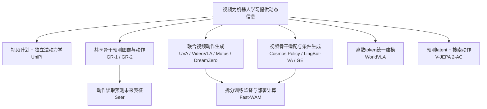

# WAM 重点文献：选择依据与技术谱系

核查日期：2026-09-25。这里回答“为什么值得重点读”，配合 [WAM 深度综述](wam-survey.md)使用。**不是按引用次数排出的影响力榜单。** 采用可追溯的一手证据：后续工作明确延续方法、采用设计、列为实验基线，或形成可用的训练/评测资源；新近课题相关论文另列。分类是本调研的阅读组织方式，不追认所有早期工作都自称 WAM。

## 1. 已有明确技术延续的基础工作

| 重点工作 | 为何是阅读主线 | 具体后续证据 | 应保留的边界 |
|---|---|---|---|
| [UniPi](related-work/unipi.md)，NeurIPS 2023 | 视频作为计划、IDM变成动作的清晰前身 | GR-1相关工作讨论；UVA §V-C列为实验对照 | UVA使用第三方重实现；不是原版权重重跑 |
| [GR-1](related-work/gr1.md)，ICLR 2024 | 人类视频预训练+机器人图像/动作联合学习 | GR-2明确延续GR-1；Seer CALVIN表列GR-1 | 早于现代大视频生成骨干WAM，方法并非扩散 |
| [GR-2](related-work/gr2.md)，2024技术报告 | 将上述路线扩到更大模型、更多视频及实机任务 | Fast-WAM related work与DreamZero related work明确讨论GR-2 | 部分训练实现细节未在报告披露，引用不等于可完整复现 |
| [Seer](related-work/seer.md)，ICLR 2025 Oral | 未来表征进入动作路径的 predictive inverse dynamics | WorldVLA和LingBot-VA将其作为LIBERO比较对象 | CALVIN平均链长与LIBERO成功率不可混用 |
| [UVA](related-work/uva.md)，RSS 2025 | 同一模型支持策略、前向/逆动力学、视频规划 | Fast-WAM明确讨论其跳过视频解码；DreamZero将其列为联合建模前作，并对比噪声时间步设计 | 名称不是UniVLA；原LIBERO主要用单外部相机 |

以上发表与采用证据可沿逐篇笔记进入原论文/官方入口；核心引用上下文在本库 [Fast-WAM related（论文入口）](https://arxiv.org/abs/2603.16666v2)、[DreamZero正文（论文入口）](https://arxiv.org/abs/2602.15922v1)、[WorldVLA实验（论文入口）](https://arxiv.org/abs/2506.21539v1)。这些证据证明技术联系，不证明所有后继方法都直接从其代码演化。

## 2. 当前 WAM 核心比较对象

| 工作 | 代表的设计问题 | 已核实的采用/比较证据 | 本轮处理 |
|---|---|---|---|
| [VideoVLA](related-work/videovla.md)，NeurIPS 2025 | 从CogVideoX直接联合去噪动作与视频 | LingBot-VA related work 的 `shen2025videovla` | 新增精读 |
| [Genie Envisioner](related-work/genie-envisioner.md)，ICLR 2026 | 多视图视频基础模型、GE-Act与GE-Sim分工 | Fast-WAM相关工作；DreamZero引言讨论其样本效率 | 新增精读 |
| [Motus](related-work/motus.md)，CVPR 2026 | 三专家、潜动作、五种条件生成模式 | LingBot-VA沿用MoT交互/视频稀疏化；Fast-WAM引用并比较；Motubrain明确延续 | 新增精读，固定arXiv v2 |
| [Cosmos Policy](related-work/cosmos-policy.md)，ICLR 2026 | 将动作/状态/value注入视频latent；可再做规划 | DreamZero正文讨论；鲁棒性研究运行公开checkpoint | 新增精读 |
| [LingBot-VA](related-work/lingbot-va.md)，RSS 2026（官方仓库标注） | 因果历史、IDM、异步反馈校正 | Fast-WAM沿用噪声增强与训练协议，表1比较 | 新增精读，区分VA2和发布权重结构 |
| [DreamZero](related-work/dreamzero.md)，2026预印本 | 大视频骨干、跨任务/本体泛化、联合自回归 | Fast-WAM引用Joint路线；鲁棒性论文作架构对照但未定量评测 | 扩写原笔记，不靠14B规模判影响 |
| [Fast-WAM](related-work/fast-wam.md)，2026预印本 | 视频监督与测试想象的受控拆分 | 鲁棒性研究v5已纳入两个基准的checkpoint评测 | 扩写原笔记，用户指定重点 |
| [WorldVLA](related-work/worldvla.md)，2025预印本 | 统一离散动作/图像自回归的替代路线 | Fast-WAM相关工作明确引用 `cen2025WorldVLA`；本轮未确认其作为后继控制实验基线的同等强证据 | 扩写；引用与架构互补共同支持纳入 |

参考一手原文：[LingBot-VA相关工作（论文入口）](https://arxiv.org/abs/2601.21998v2)、[LingBot-VA方法（论文入口）](https://arxiv.org/abs/2601.21998v2)、[Fast-WAM方法（论文入口）](https://arxiv.org/abs/2603.16666v2)、[Fast-WAM实验（论文入口）](https://arxiv.org/abs/2603.16666v2)、[鲁棒性研究v5](https://arxiv.org/abs/2603.22078v5)、[Motubrain](https://arxiv.org/abs/2604.27792v5)。Motubrain此处仅核查继承关系，未完成与本库论文同等深度的阅读。

## 3. 相邻路线与直接课题候选

| 工作 | 为什么加入 | 影响力表述 |
|---|---|---|
| [V-JEPA 2-AC](related-work/v-jepa2.md) | latent world model+MPC，且明确分析相机坐标失败 | [JEPA-WMs](https://arxiv.org/abs/2512.24497)将其作为既有基线；是相邻分支代表，非语言WAM |
| [Action Images](related-work/action-images.md) | 多视角action image+几何解码，直接连接相机与控制 | 2026新近候选；尚未建立广泛后续采用证据 |
| [WAM鲁棒性研究](related-work/wam-robustness.md) | 对相机扰动与“WAM更泛化”的主张作实证检查 | 评测论文；不是新架构，也不将一篇比较视为领域定论 |
| [SCVC](related-work/selective-cross-view-consistency.md) | 同状态配对、选择性动作/状态一致性 | 2026新近直接相关工作，不写成经典 |
| [PAIWorld](related-work/paiworld.md)、[TriWorldBench](related-work/triworldbench.md) | 多视角生成几何与评测 | 课题相关；主要证据不是机器人闭环控制 |

## 4. 按设计演进读，而非按名称读

**图中箭头表示阅读上的概念推进，不全部表示作者直接继承关系**；实际引用证据以上表为准。跨视角是贯穿这些路线的另一条轴：输入融合、几何表示、动作不变性与评测协议各自需要证据。

## 5. 名称、时间和影响力的常见误区

- VideoVLA **2512.06963** 与 *Video Generators are Robot Policies* **2508.00795** 是两篇。Fast-WAM/DreamZero中的 `liang2025video` 指后者；不能拿它证明前者被二者采用。
- Seer 本库为 **2412.15109**，不是同名视频模型 **2303.14897**。
- FAST动作tokenizer、Fast-WAM；UVA、两家UniVLA；Cosmos Predict、Cosmos Policy；Genie Envisioner、其他Genie系列，均需区分。
- 论文在2026年会议发表，不等于固定阅读的2025年arXiv版本已包含最终版所有修订。
- 新方法有开源仓库不等于完整训练数据、指定论文checkpoint和全套评测都可复现；论文没有独立复现不能写成我们已经验证。

这一轮优先补完整的代表路线。未把所有新发布工作都扩成精读卡；更多方法应先明确新增哪种机制或评测证据，再进入下一批归档。
